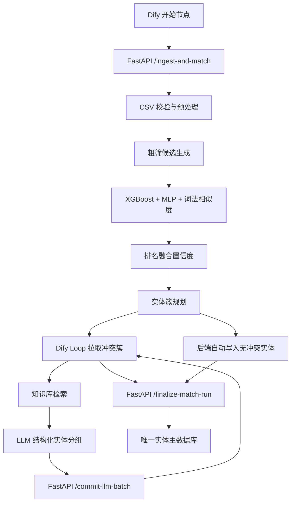

# MDM CSV 主数据匹配流程技术报告

## 1. 项目目标

本项目目标是把两个 CSV 表中的商品/软件记录整合为一张唯一实体主数据表。核心要求：

- 每条来源记录只能归属一个实体。
- 每个实体只能有一条黄金记录。
- 对明显不同的实体直接写入主数据。
- 对疑似同一实体的记录进行机器学习评分、实体簇构建和大模型判别。
- 最终必须能通过数据库质量检查，避免半成品结果。

## 2. 输入数据

标准字段：

```text
id,title,manufacturer,price
```

字段含义：

- `id`：来源表内唯一记录 ID。
- `title`：商品标题，是匹配的主信号。
- `manufacturer`：制造商/品牌，是重要约束信号。
- `price`：价格，用于发现冲突，但不是绝对判断依据。

初始化模式：

```text
tableA + tableB
```

增量模式：

```text
已有主数据库 + incoming CSV
```

## 3. 系统架构



Dify 负责流程编排，FastAPI 负责确定性计算和数据库写入。这样避免在 Dify 代码节点里运行 XGBoost、MLP、数据库事务和长时间批处理。

## 4. 预处理

预处理模块位于：

```text
mdm_matching/preprocess.py
```

主要操作：

- Unicode NFKC 规范化。
- 转小写。
- 移除 HTML。
- 移除标点。
- 合并重复空格。
- 制造商归一化。
- 品牌/制造商别名归一化。
- 价格转 float。
- 缺失值处理。
- 字段映射到标准字段。

预处理目标不是让文本更短，而是减少同一品牌、同一制造商在不同写法下造成的歧义。

## 5. 粗筛策略

粗筛由 `build_candidate_pairs` 完成。核心策略是：

- 对 tableA 和 tableB 的标题做 token 化。
- 使用 token Jaccard 作为初筛信号。
- 只保留达到粗筛阈值的候选对。

默认粗筛阈值：

```text
rough_threshold=0.18
```

低于该阈值的记录一般认为没有必要进入机器学习细筛。初始化时，如果某条记录没有被任何保留候选覆盖，会作为独立实体写入主数据。

## 6. 模型评分

模型文件：

```text
artifacts/mdm_matcher.joblib
```

训练命令：

```bash
python3 -m mdm_matching.train --data-dir structured_amazon_google --output-dir artifacts
```

使用的模型/信号：

- XGBoost：结构化特征二分类概率。
- MLP：结构化特征二分类概率。
- TF-IDF/词法相似度：稳定兜底信号。

核心特征包括：

- 字符级 TF-IDF 余弦相似度。
- 词级 TF-IDF 余弦相似度。
- title token Jaccard。
- 制造商相似度。
- 价格相似度。
- 标题长度比例。

## 7. 决策融合

融合逻辑位于 `score_candidates`：

```text
rank_fusion = (rank(xgboost) + rank(mlp) + rank(lexical)) / 3
confidence = 0.45 * rank_fusion
           + 0.35 * xgboost_score
           + 0.10 * mlp_score
           + 0.10 * lexical_score
```

该方式保留 RRF/排名融合思想，同时避免完全依赖批内相对排序。

## 8. 实体簇构建

候选对不是逐对直接写库，而是先构建实体簇：

```text
tableA 记录 <-> tableB 记录
```

只要候选对置信度达到：

```text
MDM_LLM_CLUSTER_MIN_CONFIDENCE=0.78
```

就进入同一连通分量聚类。这样可以处理：

- 一对一。
- 一对多。
- 多对一。
- 多对多。
- 分数接近竞争。

实体簇字段：

- `cluster_id`：冲突簇 ID。
- `records`：簇内所有来源记录。
- `candidates`：构成该簇的候选边。
- `table1_ids`：tableA ID 集合。
- `table2_ids`：tableB ID 集合。
- `max_confidence`：簇内最高置信度。
- `score_margin`：最高分与次高分差距。
- `has_competition`：是否存在竞争候选。
- `has_field_conflict`：制造商或价格是否冲突。

## 9. 路由规则

关键参数：

```text
threshold=0.9
MDM_AUTO_MERGE_CONFIDENCE=0.94
MDM_LLM_CLUSTER_MIN_CONFIDENCE=0.78
MDM_AMBIGUOUS_MARGIN=0.04
```

路由逻辑：

```text
一对一 + 无竞争 + 无字段冲突 + confidence >= max(threshold, 0.94)
=> 后端自动合并

max_confidence >= 0.78 但不满足自动合并条件
=> 交给 Dify 知识库 + LLM 做实体分组

粗筛没有覆盖的记录
=> 作为独立实体写入
```

低于 LLM 保留线的候选不会强行合并。最终收尾阶段会保证所有来源记录都有实体归属。

## 10. Dify 工作流参数

工作流文件：

```text
dify/mdm_workflow.yml
```

环境变量：

```text
MDM_API_BASE=http://host.docker.internal:8000
```

Loop 参数：

```text
每批冲突簇 limit: 30
loop_count: 100
```

LLM 参数：

```text
temperature: 0
max_tokens: 8192
structured_output_enabled: true
retry_config.enabled: true
max_retries: 2
```

LLM 结构化输出要求：

```json
{
  "clusters": [
    {
      "cluster_id": "cluster_0001",
      "entities": [
        {
          "canonical_title": "标题必须来自来源记录",
          "members": ["table1:1", "table2:2"],
          "aliases": ["别名"],
          "confidence": 0.95,
          "decision": "same_entity",
          "reason": "简短原因"
        }
      ]
    }
  ]
}
```

硬性规则：

- 只处理当前批次的 clusters。
- `cluster_id` 必须来自当前输入。
- 每个输入 `node_id` 必须出现且只能出现一次。
- 不同版本、平台、授权数量、套装内容不能合并。
- 如果不能确认合并，输出单成员实体。

## 11. 最终质量收尾

最终收尾接口：

```text
POST /finalize-match-run
```

职责：

- 检查 Dify/LLM 是否遗漏冲突簇。
- 对未覆盖冲突簇执行保守后端补齐。
- 补齐缺失 source link。
- 执行精确同名实体合并。
- 重建 `golden_records`。
- 返回质量报告。

保守补齐策略：

- 规范化标题完全一致且不是泛称时，可以合并。
- 其他记录作为独立实体保留。
- 不写 `uncertain`，而是写 `backend_active` 并记录原因。

不自动合并的泛称示例：

```text
software
quickbooks ( r )
deposit slips
```

## 12. 数据库表设计

### entities

唯一实体表，一行代表一个主数据实体。

字段：

- `id`：实体 ID。
- `canonical_title`：主标题。
- `manufacturer`：主制造商。
- `price`：主价格。
- `status`：写入来源状态。
- `selected_source_table`：主标题来自 tableA、tableB 或 incoming。
- `confidence`：实体置信度。
- `created_at` / `updated_at`：时间戳。

`status` 取值：

```text
backend_active
llm_active
uncertain
```

当前目标是最终结果中 `uncertain=0`。

### golden_records

兼容展示表，与 `entities` 一对一。

约束：

```text
entity_id 唯一
```

### source_record_links

来源记录到实体的映射表。

字段：

- `entity_id`
- `source_table`
- `source_id`
- `raw_payload`

约束：

```text
(source_table, source_id) 唯一
```

这是保证“每条来源记录只属于一个实体”的关键约束。

### entity_aliases

实体别名表。用于记录来源标题和规范化标题。

### match_decisions

判定日志表。记录自动合并、LLM 合并、最终收尾合并等决策。

### action_log

操作日志表。记录摄入、提交、收尾、合并、修复等操作。

## 13. API 清单

```text
GET  /health
POST /validate-upload
POST /ingest-and-match
POST /candidate-batch
POST /commit-llm-batch
POST /finalize-match-run
GET  /admin/entity-quality
POST /admin/rebuild-golden-records
POST /admin/repair-missing-source-links
POST /admin/merge-duplicate-alias-entities
```

核心执行顺序：

```text
/ingest-and-match
-> /candidate-batch
-> /commit-llm-batch
-> 多轮循环
-> /finalize-match-run
-> /admin/entity-quality
```

## 14. 质量基准

强制合格条件：

```text
valid=true
golden_records_count == entity_count
duplicate_golden_entity_id_count == 0
null_golden_entity_id_count == 0
duplicate_source_link_count == 0
table1_source_link_count == tableA 行数
table2_source_link_count == tableB 行数
uncertain_decision_count == 0
```

样例数据最终基准：

```text
tableA: 1363
tableB: 3226
source_record_links: 4589
entities: 约 4200
golden_records: 等于 entities
```

风险提示指标：

```text
duplicate_canonical_title_count
duplicate_normalized_alias_count
```

这些不直接作为失败条件，因为泛称标题可能不能安全合并。

## 15. 当前样例结果

当前样例库最终结果：

```text
entities: 4200
golden_records: 4200
source_record_links: 4589
tableA 覆盖: 1363 / 1363
tableB 覆盖: 3226 / 3226
duplicate_source_link_count: 0
uncertain_decision_count: 0
valid: true
```

剩余风险组：

```text
quickbooks ( r )
deposit slips
software
```

这些是信息不足的泛称，系统保守保留为多个实体，不自动合并。

## 16. 执行步骤总表

```text
1. 安装 Python 依赖
2. 训练或拷贝 artifacts/mdm_matcher.joblib
3. 启动 MySQL 或使用 SQLite
4. 启动 FastAPI 服务
5. 检查 /health
6. 在 Dify 导入 dify/mdm_workflow.yml
7. 设置 MDM_API_BASE
8. 设置知识库 ID
9. 第一次运行 tableA + tableB
10. 查看最终质量收尾结果
11. 调用 /admin/entity-quality 验收
12. 用 DBeaver 或 SQL 查看 entities/golden_records/source_record_links
```

## 17. 运营建议

- 开发调试用 SQLite，正式运行用 MySQL。
- 每次导入新工作流后，确认 `MDM_API_BASE` 和知识库 ID。
- 每次完整运行后必须看 `/admin/entity-quality`。
- 不要只看 Dify 是否“执行完成”，要看数据库质量指标。
- 不建议自动合并泛称标题；宁可保守拆分，也不要错误合并。
- 大模型批量大小建议保持 30，避免输出过长造成结构化输出不完整。

